# ✌️ VCoder: Versatile Vision Encoders for Multimodal Large Language Models

[](https://pytorch.org/) [](https://huggingface.co/spaces/shi-labs/VCoder) [](https://youtu.be/go493IGgVWo)

[Jitesh Jain](https://praeclarumjj3.github.io/), [Jianwei Yang](https://jwyang.github.io/), [Humphrey Shi](https://www.humphreyshi.com/home)

[[`Project Page`](https://praeclarumjj3.github.io/vcoder/)] [[`COST Dataset`](https://huggingface.co/datasets/shi-labs/COST)] [[`arXiv`](https://arxiv.org/abs/2312.14233)] [[`pdf`](https://arxiv.org/pdf/2312.14233.pdf)] [[`Video`](https://drive.google.com/file/d/1o48-1PDeGsjHcgcStjvqKpsReR3stdOe/view?usp=sharing)] [[`BibTeX`](#citation)]

This repo contains the code for our paper **VCoder: Versatile Vision Encoders for Multimodal Large Language Models**.

<p align="center">
    
</p>

<p align="center">
    
</p>

## Contents

1. [Installation Instructions](#installation-instructions)
2. [Demo](#demo)
3. [Dataset Preparation](docs/Data.md)
4. [Getting Started](#getting-started)
5. [Results](#results)
6. [Citation](#citation)

## News

- **[December 29, 2023]**: Our demo is now available on [HuggingFace Spaces](https://huggingface.co/spaces/shi-labs/VCoder). Thanks to the HF team for their support! 🤗
- **[December 21, 2023]**: [**Project Page**](https://praeclarumjj3.github.io/vcoder/), [**Dataset**](https://huggingface.co/datasets/shi-labs/COST), [**ArXiv Preprint**](https://arxiv.org/abs/2312.14233) and [**GitHub Repo**](https://github.com/SHI-Labs/VCoder) are public! 🚀
  - 🎯 VCoder is an adapter for improving MLLMs at object-level perception tasks with the aid of auxiliary perception modalities as control inputs.
  - 🎁 We also release the [COST](https://huggingface.co/datasets/shi-labs/COST) dataset to train and evaluate MLLMs at object-level perception tasks!
  - 🥁 VCoder LLaVA-1.5 and VCoder-DS LLava-1.5 checkpoints are available on [HuggingFace Hub](https://huggingface.co/models?search=vcoder)!
  - 👨🏻‍💻 **[COMING SOON]** VCoder (IT) LLaVA-1.5 trained on a mix of instruction-tuning data and COST dataset!

## Installation Instructions

We use Python 3.10 and PyTorch 2.0.1 (CUDA 11.7 build) on Ubuntu 20.04.3 LTS.

- Clone this repository.

    ```bash
    git clone https://github.com/SHI-Labs/VCoder
    cd VCoder
    ```

- Setup conda environment.

    ```bash
    conda create -n vcoder python=3.10 -y
    conda activate vcoder
    pip install --upgrade pip
    conda install -c "nvidia/label/cuda-11.7.0" cuda-toolkit
    conda install pytorch==2.0.1 torchvision==0.15.2 torchaudio==2.0.2 pytorch-cuda=11.7 -c pytorch -c nvidia
    pip install -e .
    pip install ninja
    pip install flash-attn --no-build-isolation
    ```

- Install additional packages for evaluation.

    ```bash
    python -m spacy download en_core_web_sm
    pip install --user -U nltk
    ```

## Demo

[](https://huggingface.co/spaces/shi-labs/VCoder)

You can use one of the CLI or Gradio interface to interact with VCoder LLaVA-1.5 locally.

>Note: You can obtain the segmentation map from the [OneFormer Demo](https://huggingface.co/spaces/shi-labs/OneFormer) and the depth map from [DINOv2](https://github.com/facebookresearch/dinov2/blob/main/notebooks/depth_estimation.ipynb).

### Gradio Interface

Run the following command:

```bash
CUDA_VISIBLE_DEVICES=0 python -m vcoder_llava.serve.gradio_app --model-path shi-labs/vcoder_ds_llava-v1.5-13b
```

### CLI Inference

Run the following command:

```bash
CUDA_VISIBLE_DEVICES=0 python -m vcoder_llava.serve.cli \
    --model-path shi-labs/vcoder_ds_llava-v1.5-13b \
    --image-file "vcoder_llava/serve/examples/suits.jpg" \
    --seg-image-file "vcoder_llava/serve/examples/suits_pan.png" \ # optional [reqd with depth input]
    --depth-image-file "vcoder_llava/serve/examples/suits_depth.jpeg" \ # optional
    --load-4bit # optional, you may also use --load-8bit
```

## Getting Started

Please see [Getting Started with VCoder](docs/Getting_Started.md) for training and evaluation commands.

## Results

Note that we do not finetune any parameters in the original LLaVA-1.5 models, so VCoder's performance on general question answering benchmarks is the same as [LLaVA-1.5](https://github.com/haotian-liu/LLaVA/blob/main/docs/MODEL_ZOO.md#llava-v15) .

### Benchmarking on COST

| **Model** | **Semantic**  | **Instance**  | **Panoptic**  | **Depth**  | **Checkpoint**  |
|---------|:-------------:|:-------------:|:-------------:|:-------------:|:-------------:|
|           |**CS(↑)/HS(↓)**|**CS(↑)/HS(↓)**|**CS(↑)/HS(↓)**|**DS(↓)**|         |
| VCoder LLaVA-1.5-7b    | 88.6/10.4 | 71.1/26.9 | 86.0/12.8 | - | [HF Hub](https://huggingface.co/shi-labs/vcoder_llava-v1.5-7b) |
| VCoder LLaVA-1.5-13b    | 89.0/10.0 | 73.3/25.0 | 87.2/11.6 | - | [HF Hub](https://huggingface.co/shi-labs/vcoder_llava-v1.5-13b) |
| VCoder-DS LLaVA-1.5-7b | 87.8/11.5 | 69.9/28.5 | 86.8/12.4 | 65.9 | [HF Hub](https://huggingface.co/shi-labs/vcoder_ds_llava-v1.5-7b) |
| VCoder-DS LLaVA-1.5-13b | 88.5/10.9 | 71.7/26.3 | 88.5/10.8 | 63.3 | [HF Hub](https://huggingface.co/shi-labs/vcoder_ds_llava-v1.5-13b) |

> We release the model responses used for benchmarking [here](https://drive.google.com/drive/folders/1R9meaFRneo76YIsSxIPRWPnKqgaDI-t3?usp=sharing).

## Citation

If you found VCoder useful in your research, please consider starring ⭐ us on GitHub and citing 📚 us in your research!

```bibtex
@article{jain2023vcoder,
    title={{VCoder: Versatile Vision Encoders for Multimodal Large Language Models}},
    author={Jitesh Jain and Jianwei Yang and Humphrey Shi},
    journal={arXiv},
    year={2023}
}
```

## Acknowledgement

We thank the authors of [LLaVA](https://github.com/haotian-liu/LLaVA), [OneFormer](https://github.com/SHI-Labs/OneFormer), and [DINOv2](https://github.com/facebookresearch/dinov2) for open-sourcing their codebase and checkpoints. We are also grateful to the authors of [CHAIR](https://github.com/LisaAnne/Hallucination) for releasing their synonym word mapping.
