# COST Dataset

The COST dataset includes the following components for training and evaluating MLLMs on object-level perception tasks:

- **RGB Images** obtained from the [COCO-2017](https://cocodataset.org/#download) dataset.
- **Segmentation Maps** for semantic, instance, and panoptic segmentation tasks, obtained using the publicly available [DiNAT-L OneFormer](https://github.com/SHI-Labs/OneFormer#coco) model trained on the COCO dataset.
- **Questions** obtained by prompting [GPT-4](https://chat.openai.com/) for object identification and object order perception tasks. You can find the questions in [questions.py](vcoder_llava/questions.py).
- **Depth Maps** obtained using the publicly available ViT-L/14 distilled variant of [DINOv2 DPT](https://github.com/facebookresearch/dinov2#pretrained-heads---depth-estimation) model trained on the NYUd dataset.

We represent the information from the segmentation maps and depth maps in text form to obtain the final question-answer pairs. Please refer to Sec 3.1 in our paper for more details.

<p align="center">

</p>

We provide different splits of the COST dataset for training and evaluation.

| **split** | **Number of Images** | **Number of QnA pairs** | **splits from COCO** |
| :-------: | :------------------: | :---------------------: | :------------------: |
| train     |       280k           | 280k                    | train2017, test2017, unlabeled2017 |  
| val       |       5k             | 5k                      | val2017                            |

## File Structure

```text
coco_segm_text
    ├── depth
    │   └── test
    │   │   └── ...
    │   └── train
    │   │   └── depth # contains depth maps for the train2017 split
    │   │   └── panoptic_order.txt # contains answers for object order perception task on images in test2017 split
    │   └── unlabeled
    │   │   └── ...
    │   └── val
    │   │   └── ...
    ├── test
    │   └── ...
    ├── train
    │   └── instance_inference # contains instance masks for train2017 split
    │   └── instance.txt # contains answers for instance object identification task on images in train2017 split
    │   └── panoptic_inference # contains panoptic masks for train2017 split
    │   └── panoptic.txt # contains answers for panoptic object identification task on images in train2017 split
    │   └── semantic_inference # contains semantic masks for train2017 split
    │   └── semantic.txt # contains answers for instance object identification task on images in train2017 split
    ├── unlabeled
    │   └── ...
    ├── val
    │   └── ...
```

## Citation

If you use the COST dataset, please consider starring ⭐ us on [GitHub](https://github.com/SHI-Labs/VCoder) and citing 📚 us in your research!

```bibtex
@article{jain2023vcoder,
    title={{VCoder: Versatile Vision Encoders for Multimodal Large Language Models}},
    author={Jitesh Jain and Jianwei Yang and Humphrey Shi},
    journal={arXiv},
    year={2023}
}
```
