# Dataset Preparation

While training our VCoder LLaVA-1.5 framework, we use the datasets focused on two sets of tasks: **Object Perception** and **General Question Answering**. Note that we only use General Question Answering datasets for regularization during training.

```text
playground/data
    ├── coco
    │   └── train2017
    │   └── val2017
    │   └── test2017
    │   └── unlabeled2017
    │── coco_segm_text
    │   └── depth
    │   └── train
    │   └── val
    │   └── test
    │   └── unlabeled
    ├── gqa
    │   └── images
    │   └── seg_images
    ├── ocr_vqa
    │   └── images
    │   └── seg_images
    ├── textvqa
    │   └── train_images
    │   └── seg_images
    └── vg
        ├── VG_100K
        └── VG_100K_2
        └── vg
            └── SEG_VG_100K
            └── SEG_VG_100K_2
```

## Object Perception

<p align="center">

</p>

We use our COCO Segmentation Text (**[COST](https://huggingface.co/datasets/shi-labs/COST)**) dataset to improve VCoder's performance at predicting objects, their counts and depth order in a given image. It also contains segmentation maps (obtained from [OneFormer](https://github.com/SHI-Labs/OneFormer)) and depth maps (obtained from [DINOv2 DPT](https://github.com/facebookresearch/dinov2)) corresponding to all images. For more information, please see [COST.md](COST.md).

- Download and unzip COCO images:

    ```bash
    cd playground/data
    mkdir coco
    cd coco
    http://images.cocodataset.org/zips/train2017.zip
    http://images.cocodataset.org/zips/val2017.zip
    http://images.cocodataset.org/zips/test2017.zip
    http://images.cocodataset.org/zips/unlabeled2017.zip
    unzip train2017.zip && val2017.zip && test2017.zip && unlabeled2017.zip
    ```

- Download and unzip COST dataset:

    ```bash
    cd playground/data
    wget https://huggingface.co/datasets/shi-labs/COST/resolve/main/coco_segm_text.zip
    
    # unzip object identification data
    unzip coco_segm_text.zip
    ```

## General Question Answering

**Note that you only need to download the following datasets to train VCoder-DS LLaVA-1.5 models**. We use the same datasets from [LLaVA](https://github.com/haotian-liu/LLaVA).

- Download the for Instruction Tuning [JSON](https://huggingface.co/datasets/liuhaotian/LLaVA-Instruct-150K/blob/main/llava_v1_5_mix665k.json) file:

    ```bash
    cd playground/data
    wget https://huggingface.co/datasets/liuhaotian/LLaVA-Instruct-150K/blob/main/llava_v1_5_mix665k.json
    ```

- Download and unzip GQA images:

    ```bash
    cd playground/data
    mkdir gqa
    cd gqa
    wget https://downloads.cs.stanford.edu/nlp/data/gqa/images.zip
    unzip images.zip
    
    # download segmentation maps
    wget https://huggingface.co/datasets/shi-labs/COST/resolve/main/seg_gqa.zip
    unzip seg_gqa.zip
    ```

- Download and unzip OCR-VQA images:

    ```bash
    cd playground/data
    mkdir ocr_vqa
    cd ocr_vqa
    
    # script to download OCR-VQA images
    gdown https://drive.google.com/uc?id=1r0tyZUwGCc4wIG4RkiglCGNL_nFJjR6Q
    gdown https://drive.google.com/uc?id=16eqkNbgARX1aLM4q0l5WBiPPSFbK0Elp
    python loadDataset.py

    # download segmentation maps
    wget https://huggingface.co/datasets/shi-labs/COST/resolve/main/seg_ocr_vqa.zip
    unzip seg_ocr_vqa.zip
    ```

- Download and unzip TextVQA images:

    ```bash
    cd playground/data
    mkdir textvqa
    cd textvqa
    wget https://dl.fbaipublicfiles.com/textvqa/images/train_val_images.zip
    unzip train_val_images.zip

    # download segmentation maps
    wget https://huggingface.co/datasets/shi-labs/COST/resolve/main/textvqa_seg.zip
    unzip textvqa_seg.zip
    ```

- Download and unzip Visual Genome images:

    ```bash
    cd playground/data
    mkdir vg
    cd vg
    wget https://cs.stanford.edu/people/rak248/VG_100K_2/images.zip
    wget https://cs.stanford.edu/people/rak248/VG_100K_2/images2.zip
    unzip images2.zip && unzip images.zip

    # download segmentation maps
    wget https://huggingface.co/datasets/shi-labs/COST/resolve/main/seg_vg.zip
    unzip seg_vg.zip
    ```
