# Getting Started with VCoder

This document provides a brief intro to the usage of VCoder LLaVA-1.5. Our code is based on original [LLaVA](https://github.com/haotian-liu/LLaVA), please checkout their repo for more information.

## Training

### Download LLaVA-1.5 checkpoints

We add our VCoder to a pretrained LLaVA-1.5 model and train on the COST dataset.

<details>
<summary>LLaVA-1.5-7b</summary>

[MLP Projector](https://huggingface.co/liuhaotian/llava-v1.5-mlp2x-336px-pretrain-vicuna-7b-v1.5) | [MLLM](https://huggingface.co/liuhaotian/llava-v1.5-7b)

```bash
# Download the Projector weights store them inside outputs folder
git lfs install
mkdir outputs
cd outputs
git clone https://huggingface.co/liuhaotian/llava-v1.5-mlp2x-336px-pretrain-vicuna-7b-v1.5
```

</details>

<details>
<summary>LLaVA-1.5-13b</summary>

[MLP Projector](https://huggingface.co/liuhaotian/llava-v1.5-mlp2x-336px-pretrain-vicuna-13b-v1.5) | [MLLM](https://huggingface.co/liuhaotian/llava-v1.5-13b)

```bash
# Download the Projector weights store them inside outputs folder
git lfs install
mkdir outputs
cd outputs
git clone https://huggingface.co/liuhaotian/llava-v1.5-mlp2x-336px-pretrain-vicuna-13b-v1.5
```

</details>

We provide training code for two variants of VCoder. We train all our models on 8 A100s.

### Only Trained for Object Identification and Counting

- Run `bash scripts/vcoder_train.sh` to train either of following variants on the COST dataset:

  - **VCoder LLaVA-1.5-7b**: We train the model for 2 epochs. The training time is ~8 hours.
  - **VCoder LLaVA-1.5-13b**: We train the model for 2 epochs. The training time is ~14 hours.

- Remember to set the model variant in [scripts/vcoder_train.sh](../scripts/v1_5/vcoder_train.sh) before training.

### Trained for Object Identification, Counting and Depth Order Prediction

>Note: These are the models which we use in our demo.

- Run `bash scripts/vcoder_ds_train.sh` to train either of following variants on the combination of COST dataset and General Question Answering (for regularization) datasets.

  - **VCoder-DS LLaVA-1.5-7b**: We train the model for 1 epoch. The training time is ~17 hours.
  - **VCoder-DS LLaVA-1.5-13b**: We train the model for 1 epoch. The training time is ~30 hours.

- Remember to set the model variant in [scripts/vcoder_ds_train.sh](../scripts/v1_5/vcoder_train.sh) before training.

## Evaluation

We evaluate our models on the COST val dataset. We have written our own [evaluators](../vcoder_llava/eval) for the same.

<p align="center">

</p>

### Object Identification and Counting

We evaluate on the semantic, instance and panoptic object perception tasks.

```bash
CUDA_VISIBLE_DEVICES=0,1,2,3,4,5,6,7 bash scripts/v1_5/eval/cost.sh
```

Remember to set the model variant in [scripts/v1_5/eval/cost.sh](../scripts/v1_5/eval/cost.sh) before evaluating.

### Depth Order Identification for Objects

We evaluate on the depth object perception tasks.

```bash
CUDA_VISIBLE_DEVICES=0,1,2,3,4,5,6,7 bash scripts/v1_5/eval/cost_depth.sh
```

Remember to set the model variant in [scripts/v1_5/eval/cost_depth.sh](../scripts/v1_5/eval/cost_depth.sh) before evaluating.

### General Question-Answering

- We follow the same evaluation setting from [LLaVA-1.5](https://github.com/haotian-liu/LLaVA).
- Download and unzip the eval files from [google drive](https://drive.google.com/file/d/1atZSBBrAX54yYpxtVVW33zFvcnaHeFPy/view?usp=sharing) to `./playground/data/eval`. This also provides a general structure for all datasets.

```bash
# pip3 install gdown
cd playground/data/eval
gdown https://drive.google.com/uc?id=1atZSBBrAX54yYpxtVVW33zFvcnaHeFPy
unzip eval.zip
```

#### VQAv2

- Download [`test2015`](http://images.cocodataset.org/zips/test2015.zip) and put it under `./playground/data/eval/vqav2`.
- Multi-GPU inference.

  ```bash
  CUDA_VISIBLE_DEVICES=0,1,2,3,4,5,6,7 bash scripts/v1_5/eval/vqav2.sh
  ```

- Submit the results to the [evaluation server](https://eval.ai/web/challenges/challenge-page/830/my-submission).

#### GQA

- Download the [data](https://cs.stanford.edu/people/dorarad/gqa/download.html) and [evaluation scripts](https://cs.stanford.edu/people/dorarad/gqa/evaluate.html) following the official instructions and put under `./playground/data/eval/gqa/data`.
- Multi-GPU inference.

  ```bash
  CUDA_VISIBLE_DEVICES=0,1,2,3,4,5,6,7 bash scripts/v1_5/eval/gqa.sh
  ```

#### VisWiz

- Download [`test.json`](https://vizwiz.cs.colorado.edu/VizWiz_final/vqa_data/Annotations.zip) and extract [`test.zip`](https://vizwiz.cs.colorado.edu/VizWiz_final/images/test.zip) to `test`. Put them under `./playground/data/eval/vizwiz`.
- Single-GPU inference.

  ```bash
  CUDA_VISIBLE_DEVICES=0 bash scripts/v1_5/eval/vizwiz.sh
  ```

- Submit the results to the [evaluation server](https://eval.ai/web/challenges/challenge-page/1911/my-submission).

#### POPE

- Download `coco` from [POPE](https://github.com/AoiDragon/POPE/tree/e3e39262c85a6a83f26cf5094022a782cb0df58d/output/coco) and put under `./playground/data/eval/pope`.
- Single-GPU inference and evaluate.
  
  ```bash
  CUDA_VISIBLE_DEVICES=0 bash scripts/v1_5/eval/pope.sh
  ```

### MME

- Download the data following the official instructions [here](https://github.com/BradyFU/Awesome-Multimodal-Large-Language-Models/tree/Evaluation).
- Downloaded images to `MME_Benchmark_release_version`.
- put the official `eval_tool` and `MME_Benchmark_release_version` under `./playground/data/eval/MME`.
- Single-GPU inference and evaluate.
  
  ```bash
  CUDA_VISIBLE_DEVICES=0 bash scripts/v1_5/eval/mme.sh
  ```

### MMBench

- Download [`mmbench_dev_20230712.tsv`](https://download.openmmlab.com/mmclassification/datasets/mmbench/mmbench_dev_20230712.tsv) and put under `./playground/data/eval/mmbench`.
- Single-GPU inference.
  
  ```bash
  CUDA_VISIBLE_DEVICES=0 bash scripts/v1_5/eval/mmbench.sh
  ```

- Submit the results to the [evaluation server](https://opencompass.org.cn/leaderboard-multimodal).
